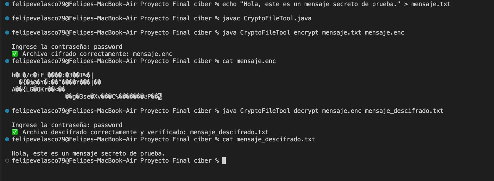

## Integrantes
Alexis Jaramillo
Felipe Velasco

## Enunciado
Este proyecto consiste en el desarrollo de un programa que aplique criptografía para una función específica, empleando para ello la API criptográfica de Java. 

1. Cifrador/descifrador de archivos. El programa debe tener dos opciones: 1) Cifrar archivo. Debe recibir como entrada un archivo cualquiera, y una contraseña. A partir de la contraseña, debe generarse una clave de 256 bits, empleando el algoritmo PBKDF2. Por último, el archivo debe cifrarse con el algoritmo AES, usando la clave obtenida; el resultado debe escribirse a otro archivo, que debe contener también el hash SHA-256 del archivo sin cifrar. 2) Descifrado: Debe recibir como entrada un archivo cifrado y la contraseña. El programa deberá descifrar el archivo y escribir el resultado en un archivo nuevo. Luego, debe computar el hash SHA-256 del archivo descifrado y compararlo con el hash almacenado con el archivo cifrado, para verificar la integridad del proceso.

Los estudiantes deben conformar equipos de 3 personas para desarrollar este proyecto. No se permite ningún tipo de plagio, o colaboración entre los equipos de trabajo. Los entregables son:

El código fuente del programa debidamente documentado, en Github.
Un pequeño informe que incluya la manera cómo hicieron el programa, las dificultades que tuvieron, y conclusiones. Este informe debe estar en formato Markdown, en el repositorio Github donde almacenaron el código.


# Estructura general del programa

El programa se organiza en dos modos de uso:

```java
if (mode.equalsIgnoreCase("encrypt")) { ... }
else if (mode.equalsIgnoreCase("decrypt")) { ... }
```

Si el usuario escribe encrypt, el programa entra en modo cifrado.

Si el usuario escribe decrypt, entra en modo descifrado.

Cumple con el requerimiento 1 de tener dos opciones (cifrar y descifrar).

## 2. Derivación de la clave con PBKDF2

```java
SecretKeyFactory factory = SecretKeyFactory.getInstance("PBKDF2WithHmacSHA256");
KeySpec spec = new PBEKeySpec(password.toCharArray(), salt, 65536, 256);
SecretKey tmp = factory.generateSecret(spec);
SecretKeySpec secret = new SecretKeySpec(tmp.getEncoded(), "AES");
```

Esto toma la contraseña ingresada por el usuario.

Usa el algoritmo PBKDF2 con HMAC-SHA256.

Aplica 65,536 iteraciones y genera una clave de 256 bits (32 bytes).

Crea una clave AES a partir de ese valor.

Cumple con el requerimiento 2: generar una clave de 256 bits usando PBKDF2 a partir de una contraseña.

## 3. Generación de sal (salt)
```java
byte[] salt = new byte[16];
new SecureRandom().nextBytes(salt);
```
Crea una sal aleatoria de 16 bytes para fortalecer la derivación de la clave (evita ataques de diccionario y rainbow tables).

La sal se guarda junto con el archivo cifrado para poder derivar la misma clave al descifrar.

Cumple la buena práctica criptográfica de incluir sal única por archivo.

## 4. Cifrado AES
```java
Cipher cipher = Cipher.getInstance("AES/CBC/PKCS5Padding");
cipher.init(Cipher.ENCRYPT_MODE, secret, iv);
byte[] encrypted = cipher.doFinal(fileData);
```

Usa AES en modo CBC (Cipher Block Chaining) con relleno PKCS5Padding.

Cifra todo el contenido del archivo de entrada (fileData).

Produce un arreglo de bytes cifrados (encrypted).

Cumple con el requerimiento 3: cifrar el archivo usando AES.

## 5. Calculo del hash SHA-256 del archivo original
```java
MessageDigest digest = MessageDigest.getInstance("SHA-256");
byte[] hash = digest.digest(fileData);
```

Calcula el hash SHA-256 del contenido sin cifrar.

Este hash servirá después para verificar la integridad del archivo cuando sea descifrado.

Cumple con el requerimiento 4: incluir el hash SHA-256 del archivo original.

## 6. Estructura del archivo cifrado

Al guardar el archivo cifrado, el programa escribe la información en este orden:

```java
outputStream.write(salt);         // 16 bytes
outputStream.write(iv.getIV());   // 16 bytes
outputStream.write(hash);         // 32 bytes
outputStream.write(encrypted);    // resto del archivo
```

por lo que el archivo .enc contiene:
```java
[SALT][IV][HASH][DATOS CIFRADOS]
```

Esto permite que al descifrar se pueda reconstruir el proceso sin información externa.

Cumple con la estructura necesaria para descifrar y verificar integridad.

## 7. Descifrado AES

Durante el modo “decrypt”:
```java
cipher.init(Cipher.DECRYPT_MODE, secret, new IvParameterSpec(iv));
byte[] decrypted = cipher.doFinal(encrypted);
```

Reconstruye la clave con PBKDF2 usando la misma contraseña y sal.

Usa el IV original guardado en el archivo.

Descifra los datos cifrados.

Cumple con el requerimiento 5: descifrar el archivo correctamente usando la contraseña.

## 8. Verificación de integridad (hash)

Después del descifrado:
```java
byte[] newHash = digest.digest(decrypted);
if (Arrays.equals(hash, newHash)) {
    System.out.println("Archivo descifrado correctamente y verificado.");
} else {
    System.out.println("El hash no coincide. Integridad comprometida.");
}
```

Calcula el hash SHA-256 del archivo descifrado.

Lo compara con el hash original guardado en el archivo cifrado.

Si son iguales → el archivo es íntegro.

Si son distintos → el archivo fue alterado o la contraseña es incorrecta.

Cumple con el requerimiento 6: verificar la integridad del archivo mediante comparación de hash.

## 9. Escritura del archivo descifrado
```java
Files.write(Paths.get(outputFile), decrypted);
```

Crea un nuevo archivo con el contenido original descifrado, sin modificar el original cifrado.

Cumple con el requerimiento final: escribir el archivo descifrado en un nuevo archivo.

## 10. Resumen del cumplimiento
| Requerimiento | Cumplido en el código 
| -------- | --------  
| Dos opciones: cifrar y descifrar  | if (mode.equalsIgnoreCase("encrypt"/"decrypt"))
| Derivar clave de 256 bits con PBKDF2	| SecretKeyFactory.getInstance("PBKDF2WithHmacSHA256")
|Cifrar con AES	| Cipher.getInstance("AES/CBC/PKCS5Padding")
|Guardar hash SHA-256 del archivo original	| MessageDigest.getInstance("SHA-256")
|Almacenar sal, IV, hash y datos cifrados	| outputStream.write() en orden correcto
|Descifrar archivo	| cipher.init(Cipher.DECRYPT_MODE, secret, iv)
|Verificar integridad comparando hashes | Arrays.equals(hash, newHash)


### El código cumple todos los requisitos del proyecto:

Usa PBKDF2 + AES-256 + SHA-256, todos algoritmos criptográficamente seguros.

Aplica buenas prácticas (uso de salt, IV aleatorio y verificación de integridad).

Permite cifrar y descifrar archivos de cualquier tipo.

Es reproducible y verificable fácilmente desde consola.


---
# Como probarlo desde la consola

## PASO 1. Preparar el entorno

### Requisitos:

- Tener instalado **Java 11 o superior**
    
    Verifícalo en la terminal:
    
    ```bash
    java -version
    ```
        
## PASO 2. Crear un archivo de prueba

Crear un archivo para que sea cifrado, por ejemplo:

```bash
echo "Hola, este es un mensaje secreto de prueba." > mensaje.txt
```


## PASO 3. Compilar el programa

En la terminal, en la misma carpeta donde esta el archivo  .java:

```bash
javac CryptoFileTool.java
```

Para generar el archivo **`.class`** (el programa compilado listo para ejecutar).


## PASO 4. CIFRAR un archivo

Ejecuta el programa en modo *encrypt*:

```bash
java CryptoFileTool encrypt mensaje.txt mensaje.enc

```
Escribe una contraseña

**Resultado:**

```
Archivo cifrado correctamente: mensaje.enc

```

Revisar el archivo cifrado con:

```bash
cat mensaje.enc
```

## PASO 5. DESCIFRAR el archivo

Ahora para el descifrado:

```bash
java CryptoFileTool decrypt mensaje.enc mensaje_descifrado.txt

```
Escribe **la misma contraseña** con la que se cifro.

Si la contraseña es correcta:

```
Archivo descifrado correctamente y verificado: mensaje_descifrado.txt
```


## PASO 6. Verificar resultados

Mirar el contenido del archivo descifrado:

```bash
cat mensaje_descifrado.txt
```

Se deberia ver el texto original:

```
Hola, este es un mensaje secreto de prueba.
```

## Ejemplo
